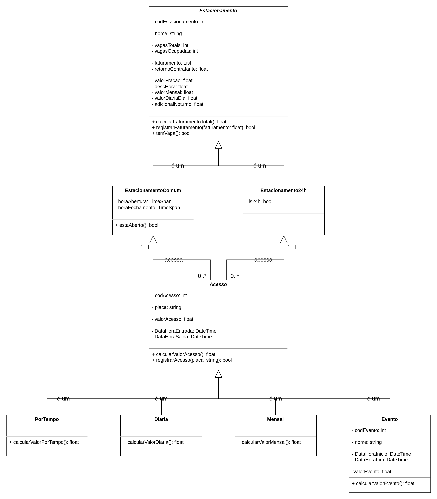

# ParkManager (Trabalho da Disciplina - TPPE 2025.1)

Sistema de Gerenciamento de Estacionamento. Utilizando .NET 9.0 para o backend, Blazor para o frontend, PostgreSQL e Docker.

### Repositório do Trabalho Antigo
[Trabalho da Disciplina - OO 2022.2](https://github.com/FabricioDeQueiroz/TrabalhoOO-Grupo-02)

---

<br>

## Diagrama de Classes do Projeto

<div align='center'>
<p>Diagrama UML de Classes:</p>
<a href="docs/assets/DiagramaClassesTPPE.png"></img></a>
</div>

## Backlog do Projeto

Backlog do projeto pode ser encontrado [aqui](https://github.com/users/FabricioDeQueiroz/projects/4) ou na aba "Projects" do repositório.

## Modelagem do Banco de Dados

Documentação do Banco de Dados do projeto pode ser encontrada [aqui](docs/MerDld.md) ou no diretório `docs/MerDld.md` do repositório.

## Arquiteura de Pastas do Projeto

A arquitetura do projeto segue o padrão **MVC** e está organizada da seguinte forma:

```plaintext
2025.1-TPPE-ParkManager/
├── .github/
├── ParkManager-Service/
│   ├── Data/
│   ├── Migrations/
│   ├── Controllers/
│   ├── Services/
│   │   └── Interfaces/
│   ├── Views/
│   ├── Models/
│   ├── Helpers/
│   ├── Tests/
│   │   ├── ParameterizedTests/
│   │   └── IntegrationTests/
│   └── wwwroot/swagger-ui/
└── docs/
        └── assets/
```

* **`2025.1-TPPE-ParkManager/` (Raiz do Repositório)**: Contém todo o código-fonte, configurações e arquivos de gerenciamento do projeto.

* **`.github/`**: Arquivos de configuração para **GitHub Actions**, e Template de Pull Requests.

* **`ParkManager-Service/`**: Backend da aplicação.
    * **`Data/`**: Gerencia o acesso e a interação com o banco de dados.
    * **`Migrations/`**: Contém os scripts para gerenciar as alterações no schema do banco de dados.
    * **`Controllers/`**: Recebe requisições HTTP e delega as operações da API.
    * **`Services/`**: Contém a lógica de negócio da aplicação.
       * **`Interfaces/`**: Define as interfaces dos serviços, promovendo a separação de responsabilidades.
    * **`Views/`**: Contém as views, que são as interfaces de usuário.
    * **`Models/`**: Define as estruturas de dados e entidades de negócio.
    * **`Tests/`**: Armazena todos os testes do serviço (Integração e Parametrizados).
    * **`wwwroot/swagger-ui/`**: Arquivos de estilização para o Swagger.

* **`docs/`**: Dedicada à **documentação** do projeto.

---

## Requisitos para executar o projeto

- [Docker](https://www.docker.com/)
- [Docker Compose](https://docs.docker.com/compose/)

## Como executar o projeto

1. **Clone o repositório**  
   ```bash
   git clone https://github.com/FabricioDeQueiroz/2025.1-TPPE-ParkManager.git
   cd 2025.1-TPPE-ParkManager

2. **Construa e inicie os containers (usando makefile)**

    ```bash
    make docker-build

3. **Acesse a aplicação:**

* Backend (API): http://localhost:8080

## Como executar os testes e o linter

1. **Execute os testes:**
   ```bash
   make docker-test
   
2. **Execute os linters:**
   ```bash
   make docker-lint
