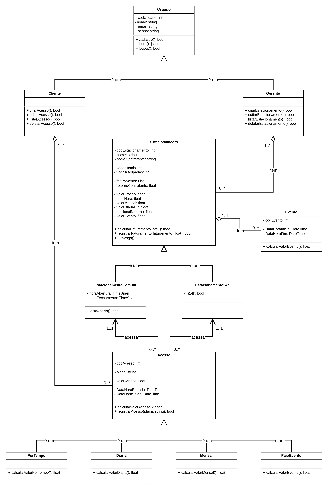

# ParkManager (Trabalho da Disciplina - TPPE 2025.1)

Sistema de Gerenciamento de Estacionamento. Utilizando .NET 9.0 para o backend, Blazor para o frontend, PostgreSQL e Docker.

### Repositório do Trabalho Antigo
[Trabalho da Disciplina - OO 2022.2](https://github.com/FabricioDeQueiroz/TrabalhoOO-Grupo-02)

---

<br>

## Diagrama de Classes do Projeto

<div align='center'>
<p>Diagrama UML de Classes:</p>
<a href="docs/assets/DiagramaClassesTPPE.png"></img></a>
</div>

## Backlog do Projeto

Backlog do projeto pode ser encontrado [aqui](https://github.com/users/FabricioDeQueiroz/projects/4) ou na aba "Projects" do repositório.

---

## Requisitos para executar o projeto

- [Docker](https://www.docker.com/)
- [Docker Compose](https://docs.docker.com/compose/)

---

## Como executar o projeto

1. **Clone o repositório**  
   ```bash
   git clone https://github.com/FabricioDeQueiroz/2025.1-TPPE-ParkManager.git
   cd 2025.1-TPPE-ParkManager

2. **Construa e inicie os containers (usando makefile)**

    ```bash
    make docker-build

3. **Acesse a aplicação:**

* Backend (API): http://localhost:8080

## Como executar os testes e o linter

1. **Execute os testes:**
   ```bash
   make docker-test
   
2. **Execute o linter:**
   ```bash
   make docker-lint
