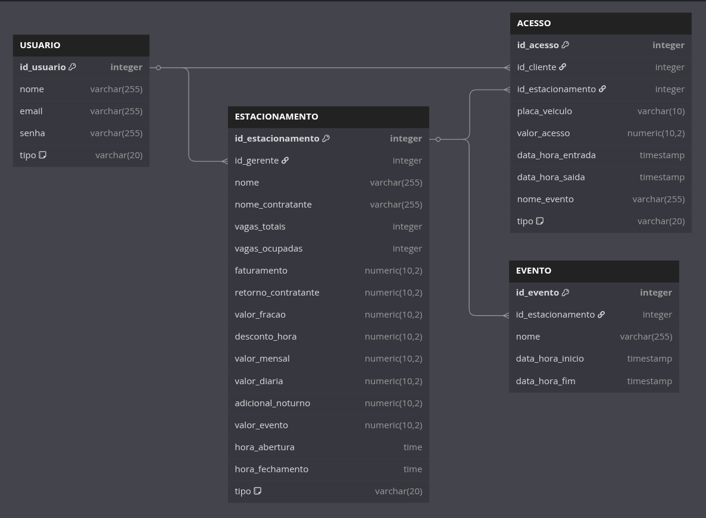

# ParkManager: Modelo Entidade-Relacionamento

## Modelo Entidade Relacionamento (ME-R):

### Identificação das Entidades:

- **USUARIO**;
- **ESTACIONAMENTO**;
- **EVENTO**;
- **ACESSO**;

### Descrição das Entidades:

- **USUARIO**:
  - id_usuario (PK)
  - nome
  - email (UNIQUE)
  - senha (hash)
  - tipo (ENUM: GERENTE, CLIENTE)

- **ESTACIONAMENTO**:
  - id_estacionamento (PK)
  - nome
  - nome_contratante
  - vagas_totais
  - vagas_ocupadas (NULLABLE)
  - faturamento
  - retorno_contratante
  - valor_fracao
  - desconto_hora
  - valor_mensal
  - valor_diaria
  - adicional_noturno
  - valor_evento
  - hora_abertura (NULLABLE)
  - hora_fechamento (NULLABLE)
  - tipo (ENUM: COMUM, 24H)
  - id_gerente (FK -> id_usuario)

- **EVENTO**:
  - id_evento (PK)
  - nome
  - data_hora_inicio
  - data_hora_fim
  - id_estacionamento (FK -> id_estacionamento)

- **ACESSO**:
  - id_acesso (PK)
  - placa_veiculo
  - valor_acesso (NULLABLE)
  - data_hora_entrada
  - data_hora_saida (NULLABLE)
  - nome_evento (NULLABLE)
  - tipo (ENUM: POR_TEMPO, DIARIA, MENSAL, EVENTO)
  - id_cliente (FK -> id_usuario)
  - id_estacionamento (FK -> id_estacionamento)

### Descrição dos Relacionamentos:

- **USUARIO** - **gerencia** - **ESTACIONAMENTO**:
  - Um Gerente pode gerenciar vários Estacionamentos, e um Estacionamento é gerenciado por um único Gerente.
  - Cardinalidade: **1:N**.

- **ESTACIONAMENTO** - **possui** - **EVENTO**:
  - Um Estacionamento pode possuir vários Eventos, e um Evento pertence a um único Estacionamento.
  - Cardinalidade: **1:N**.

- **USUARIO** - **realiza** - **ACESSO**:
  - Um Cliente pode realizar vários Acessos, e um Acesso é realizado por um único Cliente.
  - Cardinalidade: **1:N**.

- **ESTACIONAMENTO** - **registra** - **ACESSO**:
  - Um Estacionamento pode registrar vários Acessos, e um Acesso é registrado em um único Estacionamento.
  - Cardinalidade: **1:N**.

### Diagrama Lógico de Dados (DLD):

Diagrama Lógico de Dados

<a href="assets/DiagramaLogicoDados.png"></img></a>

